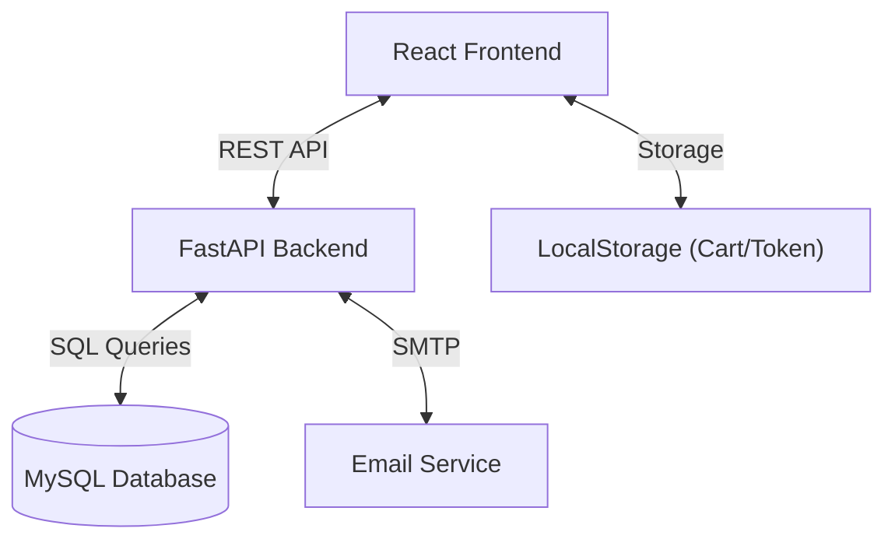
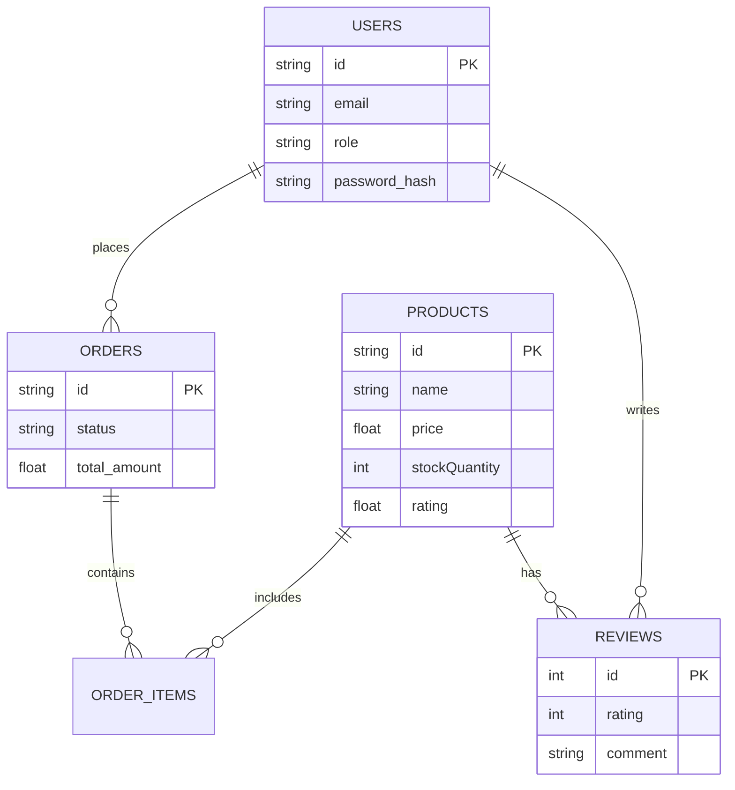

# EliteShop - Premium Full-Stack E-commerce Platform

**EliteShop** is a modern, high-performance E-commerce application featuring a React frontend and a robust FastAPI backend. It is designed to demonstrate professional-grade shopping experiences including product management, user authentication, persistent carts, and admin operations.

## 🚀 Key Features and Updates

### ✅ Full Stack Implementation
- **Backend**: Built with **FastAPI** (Python), capable of handling asynchronous requests for high performance.
- **Frontend**: Developed with **React.js** (Vite) + **Tailwind CSS** for a responsive, modern UI.
- **Database**: **MySQL** database with a comprehensive schema (Products, Users, Orders, Reviews).

### ✅ New Features (v1.1)
- **Product Reviews System**: Users can rate (1-5 stars) and review items. Product ratings and counts update automatically.
- **Persistent Shopping Cart**: Cart data is saved locally and keyed to specific users, ensuring a seamless experience across sessions.
- **Order Notifications**: Automatic email confirmation simulation upon successful order placement.
- **Admin Dashboard**: Secure admin panel to view sales stats, manage products, and track orders.

### 📸 Architecture Overview


## 🛠️ Tech Stack

- **Frontend**: React, TypeScript, Tailwind CSS, Lucide Icons, React Router.
- **Backend**: FastAPI, Pydantic, Uvicorn, Python-Jose (JWT).
- **Database**: MySQL (via `mysql-connector-python`).
- **Tools**: Git, npm, pip.

## 🗄️ Database Schema


## 🚀 Getting Started

### Prerequisites
- Node.js & npm
- Python 3.8+
- MySQL Server

### 1. Backend Setup
```bash
cd backend_fastapi
# Create virtual environment (optional)
python -m venv venv
source venv/bin/activate # or venv\Scripts\activate on Windows

# Install dependencies
pip install -r requirements.txt

# Configure Environment
# Rename .env.example to .env and updated DB/SMTP credentials

# Run Server
uvicorn main:app --reload
```
*API will run at `http://localhost:8000`*
*API Documentation: `http://localhost:8000/docs`*

### 2. Frontend Setup
```bash
# In the root directory
npm install
npm run dev
```
*Frontend will run at `http://localhost:5173`*

## 📚 API Documentation

Access the interactive Swagger UI at **http://localhost:8000/docs** to verify the "Proper Backend API".

### Key Endpoints
- **Auth**: `/api/auth/login`, `/api/auth/register`
- **Products**: `/api/products` (Get, Create, Update, Delete)
- **Reviews**: `/api/reviews` (Post, Get, Delete)
- **Orders**: `/api/orders` (Create, History)

## 🤝 Contributing

1. Fork the repository
2. Create your feature branch (`git checkout -b feature/AmazingFeature`)
3. Commit your changes (`git commit -m 'Add some AmazingFeature'`)
4. Push to the branch (`git push origin feature/AmazingFeature`)
5. Open a Pull Request

---
**Built by QuantumNexus0**
