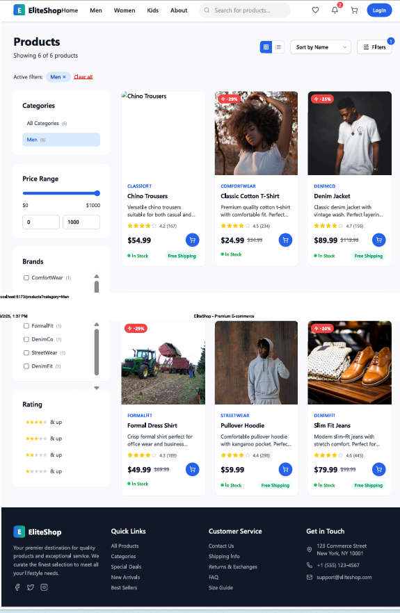

# EliteShop - Modern E-commerce Platform

A sleek and responsive e-commerce website featuring a modern design with gradient backgrounds, product showcases, and comprehensive shopping functionality.

## 📸 Screenshots

### Homepage Hero Section

*Modern homepage with "New Arrivals" hero section featuring the latest tech innovations and key statistics (10K+ customers, 500+ products, 50+ brands, 24/7 support)*

### Featured Products Gallery

*Curated selection of premium products including fashion, electronics, and lifestyle items with star ratings, pricing, and quick purchase options*

### Newsletter & Customer Reviews Section

*Newsletter subscription with gradient background, customer testimonials with star ratings, and comprehensive footer with contact information*

### Product Catalog & Filtering

*Advanced product filtering system with categories, price range, brands, and ratings. Showing products with detailed information, pricing, and quick purchase options*

### Shopping Cart & Checkout Process

*Interactive shopping cart with quantity adjustment, item removal, and order summary with secure SSL checkout*

### Payment Process Flow

*Step 1: Shipping Information - Complete address form with validation*

*Step 2: Payment Information - Secure card processing with encrypted data*

*Step 3: Order Review - Final order confirmation with complete order details*

### Admin Dashboard

*Administrative interface for managing products, orders, and store operations*

## 🛠️ Technologies Used

- HTML5
- CSS3 (Grid & Flexbox)
- JavaScript
- React.js
- Tailwind CSS
- TypeScript
- Responsive Design
- Modern UI/UX principles
- Gradient Design Elements

## ✨ Key Features

### 🛒 E-commerce Functionality
- **Advanced Product Filtering**: Filter by categories, price range, brands, and ratings
- **Product Catalog**: Comprehensive product listings with detailed information
- **Smart Search**: Sort products by name, price, and popularity
- **Grid/List View**: Toggle between different product display layouts
- **Shopping Cart Management**: Add/remove items, quantity adjustment, price calculation
- **3-Step Checkout Process**: Shipping → Payment → Order Review
- **Secure Payment Processing**: SSL encrypted checkout with multiple payment options
- **Order Summary**: Real-time calculation of subtotal, shipping, tax, and total
- **Stock Management**: Real-time stock availability indicators
- **Admin Dashboard**: Administrative interface for store management
- **Responsive Design**: Full mobile and tablet optimization

### 💳 Complete Checkout Flow
- **Step 1 - Shipping Information**: Complete address form with validation
- **Step 2 - Payment Information**: Secure card processing with encrypted data
- **Step 3 - Order Review**: Final order confirmation with all details
- **Order Summary Sidebar**: Live updates of pricing and shipping
- **Security Features**: SSL encryption and secure payment indicators

### 🔧 Admin Management
- **Admin Dashboard**: Complete administrative interface for store management
- **Product Management**: Add, edit, and manage product inventory
- **Order Management**: Track and process customer orders
- **Store Analytics**: Monitor sales performance and customer data

### 🔍 Advanced Filtering System
- **Categories**: All Categories, Men's items with subcategories
- **Price Range**: Customizable price slider ($1 - $1000)
- **Brands**: Filter by ComfortWear, DenimCo, StreetWear, and more
- **Ratings**: Filter by customer ratings (1-5 stars)
- **Stock Status**: In-stock availability filtering

### 🎨 Design Features
- **Modern Gradient Design**: Purple to blue gradient backgrounds
- **Responsive Layout**: Optimized for all device sizes
- **Interactive Elements**: Hover effects and smooth transitions
- **Professional Typography**: Clean, readable font choices

### 🏪 Shopping Experience
- Best Sellers showcase
- Flash Sale promotions
- Gift Cards availability
- Newsletter subscription with exclusive deals
- Customer review system with star ratings

### 📱 User Interface
- Intuitive navigation (Home, Men, Women, Kids, About)
- Search functionality
- User account features (Login/Register)
- Shopping cart with item counter
- Category-based browsing

## 📱 Responsive Design

The website is fully optimized for:
- **Desktop** (1200px+): Full feature layout with sidebar navigation
- **Tablet** (768px - 1199px): Adapted grid layout
- **Mobile** (320px - 767px): Touch-friendly interface with collapsible menus

## 🎯 Business Features

- Newsletter subscription with 50,000+ subscribers
- Customer testimonials and review system
- Social media integration
- Contact information and store locations
- Brand partnerships and featured suppliers

## ⚠️ Current Limitations

**Frontend-Only Implementation**: This is a complete UI/UX demonstration without backend database connectivity. Features include:

- ✅ **Fully Functional UI**: All pages, forms, and interactions work perfectly
- ✅ **Responsive Design**: Optimized for all device sizes
- ✅ **Complete Checkout Flow**: 3-step process with form validation
- ✅ **Cart Management**: Add, remove, and modify items (session-based)
- ❌ **Database Integration**: No persistent data storage
- ❌ **Payment Processing**: No actual payment gateway integration
- ❌ **User Accounts**: No user registration/login system
- ❌ **Order Management**: No order tracking or history

**Perfect for**: Portfolio demonstrations, UI/UX showcases, frontend development examples, and as a foundation for full-stack development.

## 🚀 Getting Started

### Prerequisites
- Modern web browser
- Internet connection for external resources

## 💻 Usage

### Shopping Experience
1. **Browse Products**: Navigate by category or use search functionality
2. **Filter & Sort**: Use advanced filters to find specific items
3. **Add to Cart**: Select products and add them to your shopping cart
4. **Review Cart**: Adjust quantities or remove items as needed
5. **Secure Checkout**: Complete the 3-step checkout process
   - Enter shipping information with address validation
   - Provide secure payment details with SSL encryption
   - Review and confirm your complete order
6. **Order Confirmation**: Receive order details and tracking information

### Key Shopping Features
- Real-time price calculations including tax and shipping
- Free shipping on orders over $50
- Secure SSL-encrypted payment processing
- Mobile-responsive design for shopping on any device
- Order summary with detailed breakdown of all charges

## 🎨 Design Philosophy

- **Clean & Modern**: Minimalist design with strategic use of gradients
- **User-Centered**: Intuitive navigation and clear call-to-action buttons
- **Brand Consistent**: Professional color scheme and typography
- **Performance Focused**: Optimized loading times and smooth interactions

## 🤝 Contributing

Contributions are welcome! Please feel free to submit a Pull Request.

1. Fork the repository
2. Create your feature branch 
3. Commit your changes 
4. Push to the branch 
5. Open a Pull Request

## 🙏 Acknowledgments

- Modern UI/UX design inspiration
- Responsive design best practices
- E-commerce functionality standards
- Customer experience optimization

---

⭐ **If you found this project helpful, please give it a star!**

*Built with passion for modern e-commerce experiences*
